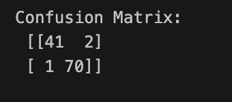
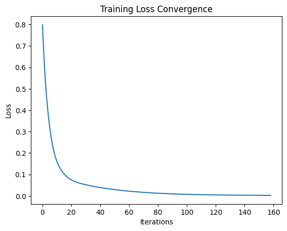

# Sample_NN-_Experiment
Breast Cancer Detection
<H3>Yogeshvar M</H3>
<H3>ENTER YOUR REGISTER NO.</H3>
<H3>EX. NO.1</H3>
<H3>DATE</H3>
# Experiment--Implementation-of-MLP-for-Breast-Cancer-Detection
## AIM:

To perform Data preprocessing in a data set downloaded from Kaggle

## EQUIPMENTS REQUIRED:
Hardware – PCs
Anaconda – Python 3.7 Installation / Google Colab /Jupiter Notebook

## Algorithm:
Step 1:Import the required libraries: numpy, pandas, MLPClassifier, train_test_split, StandardScaler, accuracy_score, and matplotlib.pyplot.
Step 2:Load the heart disease dataset from a file using pd.read_csv().
Step 3:Separate the features and labels from the dataset using data.iloc values for features (X) and data.iloc[:, -1].values for labels (y).
Step 4:Split the dataset into training and testing sets using train_test_split().
Step 5:Normalize the feature data using StandardScaler() to scale the features to have zero mean and unit variance.
Step 6:Create an MLPClassifier model with desired architecture and hyperparameters, such as hidden_layer_sizes, max_iter, and random_state.
Step 7:Train the MLP model on the training data using mlp.fit(X_train, y_train). The model adjusts its weights and biases iteratively to minimize the training loss.
Step 8:Make predictions on the testing set using mlp.predict(X_test).
Step 9:Evaluate the model's accuracy by comparing the predicted labels (y_pred) with the actual labels (y_test) using accuracy_score().
Step 10:Print the accuracy of the model.
Step 11:Plot the error convergence during traini#ng using plt.plot() and plt.show().
## Program:
```python
import numpy as np
import pandas as pd
from sklearn.datasets import load_breast_cancer
from sklearn.neural_network import MLPClassifier
from sklearn.model_selection import train_test_split
from sklearn.preprocessing import StandardScaler
from sklearn.metrics import accuracy_score, confusion_matrix
import matplotlib.pyplot as plt

# Load Dataset
data = load_breast_cancer()
X = data.data
y = data.target

# Preprocess Dataset (optional DataFrame creation)
df = pd.DataFrame(X, columns=data.feature_names)
df['target'] = y

# Normalize Dataset
scaler = StandardScaler()
X_scaled = scaler.fit_transform(X)

# Split for Train and Test Data
X_train, X_test, y_train, y_test = train_test_split(
    X_scaled, y, test_size=0.2, random_state=42
)

# Create MLP and Train MLP
mlp = MLPClassifier(
    hidden_layer_sizes=(100, 50),
    activation='relu',
    solver='adam',
    max_iter=500,
    random_state=42
)
mlp.fit(X_train, y_train)

# Predict with Test Data
y_pred = mlp.predict(X_test)

# Model Evaluation
accuracy = accuracy_score(y_test, y_pred)
print("Model Accuracy:", accuracy)

cm = confusion_matrix(y_test, y_pred)
print("Confusion Matrix:\n", cm)

# Training Loss Characteristics
plt.plot(mlp.loss_curve_)
plt.xlabel("Iterations")
plt.ylabel("Loss")
plt.title("Training Loss Convergence")
plt.show()
```
## Output:


## Result:
Thus, an ANN with MLP is constructed and trained to predict the breast cancer using python.

